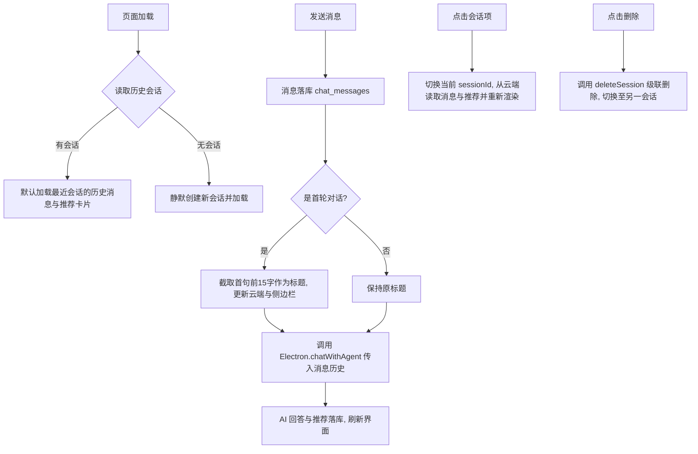

# AI 顾问智能体记忆与多会话系统 (Agent Memory & Sessions) 设计文档

本文档定义了“留学通”中 AI 顾问（智能体）记忆系统持久化与多会话管理的设计规格、数据库表结构和前端数据流向。

---

## 1. 系统概述

本系统旨在为“AI 顾问”赋予生产级别的**长期记忆（Long-term Memory）**与**会话管理（Session Management）**能力。

在大用户量并发、多终端访问场景下，AI 智能体将能够：
1.  **持久化保存会话与消息**：聊天历史不再“阅后即焚”，自动沉淀并同步至云端数据库。
2.  **会话标题智能提取**：根据用户的第一轮对话意图，AI 智能体自动提炼会话主题。
3.  **多会话自主切换与创建**：支持用户在左侧栏自由切换不同咨询话题，或新建/删除会话。
4.  **推荐清单会话沙箱隔离**：右侧 AI 推荐清单与会话深度绑定，切换会话时自动恢复对应话题下的推荐列表。
5.  **多用户安全隔离 (RLS)**：严格通过 Supabase 行级安全（Row Level Security）机制，防止多用户间数据泄漏。

---

## 2. 数据库设计 (Supabase SQL)

我们采用 **关系型（消息实体）+ 非关系型（推荐清单 JSONB）** 的混合设计，以保障 Agent 在面对互联网未知爬虫数据时的弹性和高容错。

### 2.1 会话表 (`chat_sessions`)
```sql
CREATE TABLE IF NOT EXISTS public.chat_sessions (
    id UUID PRIMARY KEY DEFAULT gen_random_uuid(),
    user_id UUID NOT NULL REFERENCES auth.users(id) ON DELETE CASCADE, -- 用户注销后自动清空其会话
    title TEXT NOT NULL DEFAULT '新会话',                               -- 默认标题
    recommended_programs JSONB DEFAULT '[]'::jsonb,                  -- 存储该会话生成的推荐项目列表（高容错性）
    created_at TIMESTAMP WITH TIME ZONE DEFAULT timezone('utc'::text, now()) NOT NULL,
    updated_at TIMESTAMP WITH TIME ZONE DEFAULT timezone('utc'::text, now()) NOT NULL
);
```

### 2.2 消息表 (`chat_messages`)
```sql
CREATE TABLE IF NOT EXISTS public.chat_messages (
    id UUID PRIMARY KEY DEFAULT gen_random_uuid(),
    session_id UUID NOT NULL REFERENCES public.chat_sessions(id) ON DELETE CASCADE, -- 会话删除后级联删除消息
    role TEXT NOT NULL CHECK (role IN ('user', 'assistant', 'system')),             -- 限制发言角色
    content TEXT NOT NULL,                                                          -- 消息正文
    created_at TIMESTAMP WITH TIME ZONE DEFAULT timezone('utc'::text, now()) NOT NULL
);
```

### 2.3 RLS 行级安全策略 (Row Level Security)
```sql
-- 启用安全模式
ALTER TABLE public.chat_sessions ENABLE ROW LEVEL SECURITY;
ALTER TABLE public.chat_messages ENABLE ROW LEVEL SECURITY;

-- 会话表策略：仅允许用户管理自己 (user_id = auth.uid()) 的会话
CREATE POLICY "Users can manage their own chat sessions" 
    ON public.chat_sessions
    FOR ALL
    USING (auth.uid() = user_id)
    WITH CHECK (auth.uid() = user_id);

-- 消息表策略：仅允许用户管理属于自己会话的消息
CREATE POLICY "Users can manage their own messages" 
    ON public.chat_messages
    FOR ALL
    USING (
        EXISTS (
            SELECT 1 FROM public.chat_sessions s 
            WHERE s.id = chat_messages.session_id AND s.user_id = auth.uid()
        )
    );
```

---

## 3. 服务层接口设计 (`chatService.js`)

在 React 前端提供统一的封装方法操作云端：

| 方法名 | 参数 | 返回值 | 业务场景描述 |
| :--- | :--- | :--- | :--- |
| `getSessions(userId)` | `userId` | `Promise<Array>` | 加载左侧历史会话列表，按更新时间降序 |
| `createSession(userId, title)` | `userId`, `title` | `Promise<Object>` | 创建一个新会话记录并返回 |
| `deleteSession(sessionId)` | `sessionId` | `Promise<void>` | 删除选中的会话及联级关联的消息历史 |
| `updateSessionTitle(sessionId, newTitle)`| `sessionId`, `newTitle` | `Promise<void>` | 修改会话的标题（通常为智能提取的用户提问首句） |
| `updateSessionRecommendations(sessionId, programs)`| `sessionId`, `programs` | `Promise<void>` | 覆盖并保存会话聚合产生的 AI 推荐列表 JSON |
| `getMessages(sessionId)` | `sessionId` | `Promise<Array>` | 加载该会话下的所有聊天消息，用于气泡区渲染 |
| `saveMessage(sessionId, role, content)` | `sessionId`, `role`, `content` | `Promise<void>` | 消息落库（用于用户发送或 AI 回复完毕的瞬间） |

---

## 4. 前端交互与状态机管理 (`AiAdvisorPage.jsx`)

### 4.1 核心状态流转


### 4.2 智能体交互设计细节
1.  **静默自动命名**：会话的初始标题默认为“新会话”。一旦用户发送第一条提问，系统将提问内容的头 15 个字截取并存入 `title`，左侧侧边栏对应的文本会实时刷新。
2.  **沙箱推荐库**：每个会话的推荐项目只属于自己。例如在“加拿大选校”会话中，右侧一键导入区显示的多伦多大学等项目；切换到“英国选校”后，右侧会自动更新为帝国理工等项目，避免项目混淆。
3.  **视觉高亮**：左侧选中的会话卡片添加 `bg-indigo-50 border-indigo-200 text-indigo-700` 高亮高拟真底色。Hover 状态下呈现淡色反馈，右上角浮现 `✕` 删除小按钮。

---

## 5. 智能体系统提示准则 (Agent Prompt & Rules)

为了向用户提供主动诊断、时效性强、千人千面的专业咨询体验，我们将对 [ai_advisor.js](file:///e:/Projects/study-abroad/electron/main/ai_advisor.js) 中的大模型系统提示词（System Prompt）进行深度升级：

```markdown
# 角色与人设
你是一个具有多年行业经验、专业且热诚的“留学申请专家导师与顾问”。你不仅是答疑的工具，更是一位人生导师。你的语气应当专业、严谨、温暖且循循善诱，致力于通过科学的规划帮助用户实现留学梦想。

# 核心能力与范围
1. 留学百科全书：解答关于留学的一切事宜，包括院校库与项目探索、申请流程与关键时间线规划、签证指导、海外生活与住宿指引、费用预算等。
2. 主动背景匹配与定位：如果用户不知道自己适合去哪或能申请什么档次的学校，你应当主动询问并收集用户的关键背景信息（GPA、语言成绩 TOEFL/IELTS、本科专业背景、预算限制、偏好国家等），为其进行定位与录取匹配评估。
3. 探索与推荐：主动为用户发掘、科普并推荐可能适合他们、但他们目前尚未知晓的优质项目。

# 行为准则
1. 联网检索与时效性约束 (Search & Fact-Checking)：
   - 对于大学的招生要求、录取标准、截止日期等关键信息，必须通过网络检索，且必须优先采信来自学校官网（如 .edu 域名或学校官方发布渠道）的最新、可信数据。
   - 当你不确定或者需要获取最新的政策时，必须触发检索指令。输出格式为：SEARCH:[搜索词]（例如：SEARCH:[帝国理工学院计算机硕士2026年最新录取要求]）。
2. 个性化适应与学习能力 (Adaptive Learning & Memory)：
   - 密切关注并记住用户在当前会话中提到的所有背景数据、偏好和顾虑（如“更喜欢大城市”、“预算有限”、“想走学术研究路线”）。
   - 在后续的对话中，你应当不断调整你的推荐契合度，使每一次给出的方案都比上一次更契合该用户的特定习惯与特征。
3. 结构化输出与看板联动 (Structured Output)：
   - 如果用户表达了对某个项目的强烈意愿，或者你为用户推荐了具体的项目，你必须在回答的最后附加一个 JSON 数组，方便系统一键导入看板：
     RECOMMENDED_PROGRAMS:
     [{"title": "项目名称", "university_id": "大学UUID"}]
4. 文书与材料辅助管理（未来能力扩展）：
   - 你具备优秀的学术写作指导能力，随时准备在用户请求下，协助其规划、撰写和润色留学文书（如个人陈述 SoP、个人简历 CV、推荐信 LoR）以及生成自定义的申请准备进度表 (Checklist)。
```

---

## 6. 测试与验证计划

### 6.1 数据库安全策略 (RLS) 验证
*   使用用户 A 登录，并在控制台尝试查询用户 B 的 `chat_sessions` 数据，确认 Supabase 返回空数组，确保数据防泄漏。

### 6.2 状态与规则测试
*   **会话独立性测试**：新建三个不同的会话，各自发送不同的问题。确认右侧的推荐项目随会话切换而自动更换，且消息历史完全隔离。
*   **主动引导测试**：发送“我想去美国读计算机，但不知道选什么学校”，确认 AI 不会直接胡编乱造，而是会主动追问用户的绩点 (GPA)、语言成绩 (托福/雅思) 等背景细节。
*   **时效性与真实性测试**：询问一个大学的最新的截止日期（例如 CMU 计算机硕士），观察 AI 是否输出了 `SEARCH:[cmu mscs deadline]` 格式触发后台爬虫进行实时联网事实检索。
*   **数据还原测试**：刷新页面后，确认上次关闭时的会话和聊天记录能够被完整还原。
